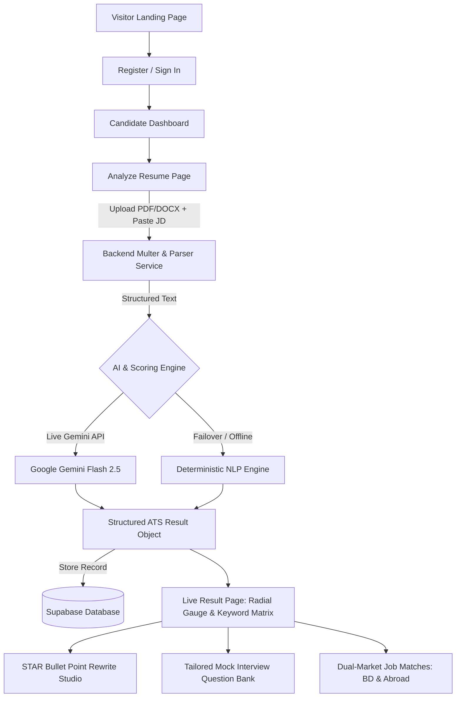

# MatchPoint AI — Week 09 Progress & Integration Report

**Course**: CSE4104 — Web Application Development  
**Section**: 7A  
**Team**: T05  
**Project Title**: MatchPoint AI — AI-Powered ATS Resume Analyzer & Interview Preparation Platform  
**Submission Date**: August 19, 2026  
**Document Identifier**: `CSE4104-7A-T05_Week09Progress`  

---

## 👥 1. Team Identification & Member Contribution

| Member Name | Student ID | Academic Role | Core Development Responsibilities |
| :--- | :--- | :--- | :--- |
| **Junnatul Farhana** | 11230121088 | Team Leader | Project Management, SRS & Workflow Governance, QA & Integration Verification |
| **Farhana Azgar Orin** | 11230121070 | Frontend / UI Lead | UI/UX Design, React Component Architecture, Radial ATS HUD, Theme Engine, Responsive Layouts |
| **Victor Mallick** | 11210320676 | Backend & Full-Stack | Express REST APIs, Document Parsers (PDF/DOCX), Authentication Middleware, Full-Stack Integration |
| **Easin Mohammad Rayhan** | 11220120789 | Database & AI Lead | PostgreSQL / Supabase Schema & RLS Policies, Google Gemini Multi-Key Pool, Prompt Engineering |

---

## 📋 2. Feature Completion Checklist & Status Matrix

| Module / Feature | Proposal Reference | Status | Completion % | Implementation Summary & Technical Reference |
| :--- | :--- | :---: | :---: | :--- |
| **User Authentication & RBAC** | SRS §2.1 | 🟢 **Completed** | 100% | Registration, login, logout, password visibility toggles (`Eye`/`EyeOff`), candidate vs. admin route protection. |
| **Document Parser Engine** | SRS §2.2 | 🟢 **Completed** | 100% | In-memory binary parsing for **PDF** (`pdfjs-dist`) and **DOCX** (`mammoth`) with zero temporary file leaks. |
| **Job Description Ingestion** | SRS §2.3 | 🟢 **Completed** | 100% | Role title, company name, and full JD text input on `/analyze` with form validation. |
| **ATS Score & Keyword Gap Engine** | SRS §2.4 | 🟢 **Completed** | 100% | Multi-dimensional scoring, matched competencies vs. missing keywords, and dynamic **Radial Target HUD Gauge**. |
| **Before/After Bullet Point Optimizer** | SRS §2.5 | 🟢 **Completed** | 100% | Interactive side-by-side comparison of unquantified drafts vs. STAR-framework AI rewrites with 1-click clipboard copy. |
| **Tailored Interview Question Bank** | SRS §2.6 | 🟢 **Completed** | 100% | Categorized into Technical, Behavioral, and HR & Culture with Recruiter Intent and STAR answering strategies. |
| **Dual-Market Job Matching** | SRS §2.7 | 🟢 **Completed** | 100% | Dual-market filtering for **🇧🇩 Bangladesh Tech** and **🌍 Global Remote** roles with 1-click LinkedIn search links. |
| **Candidate History & Profile** | SRS §2.8 | 🟢 **Completed** | 100% | Timestamped analysis logs on `/history` and editable career preferences on `/profile`. |
| **Admin Operations Dashboard** | SRS §2.9 | 🟢 **Completed** | 100% | User monitoring, platform metrics, AI token tracking, service health, and audit logs on `/admin/*`. |
| **AI Auto-Failover Pool** | Week 08 Plan | 🟢 **Completed** | 100% | Multi-key failover across `GEMINI_API_KEY_1..3` + deterministic local NLP fallback. |

---

## 🔄 3. Major End-to-End User Workflows

### Workflow Execution Details:
1. **Candidate Onboarding**: User creates an account or logs in. Credentials are verified against Supabase Auth, returning a JWT token stored in `localStorage`.
2. **Resume & Job Ingestion**: Candidate uploads a PDF/DOCX resume and pastes the target job description.
3. **Server-Side Extraction & Prompting**: `parserService.js` extracts raw text streams and dispatches a structured prompt to the Google Gemini AI Multi-Key Pool.
4. **Result Generation & Persistence**: The ATS engine computes score metrics, keyword alignment, and STAR bullet point improvements. The record is saved in `analysis_records` table.
5. **Interview & Career Preparation**: Candidate explores customized Technical, Behavioral, and HR questions with recruiter context notes, and applies to matched job listings with one click.

---

## 🔌 4. Frontend–Backend & Database Integration Status

### API Endpoint Health & Integration Matrix

| HTTP Method | API Route | Controller / Service | Connected Frontend Component | Status |
| :---: | :--- | :--- | :--- | :---: |
| `GET` | `/api/health` | `server.js` | System Health Monitoring | 🟢 **200 OK** |
| `POST` | `/api/auth/register` | `authController.js` | `RegisterPage.jsx` | 🟢 **200 OK** |
| `POST` | `/api/auth/login` | `authController.js` | `LoginPage.jsx` | 🟢 **200 OK** |
| `POST` | `/api/auth/logout` | `authController.js` | `AppLayout.jsx` | 🟢 **200 OK** |
| `POST` | `/api/upload` | `uploadController.js` | `AnalyzePage.jsx` | 🟢 **200 OK** |
| `POST` | `/api/analysis/gap-analysis` | `analysisController.js` | `AnalyzePage.jsx` $\to$ `ResultPage.jsx` | 🟢 **200 OK** |
| `POST` | `/api/interview/generate` | `interviewController.js` | `InterviewPage.jsx` | 🟢 **200 OK** |
| `POST` | `/api/jobs/recommendations` | `jobsController.js` | `JobsPage.jsx` | 🟢 **200 OK** |
| `GET` | `/api/user/history` | `userController.js` | `HistoryPage.jsx`, `DashboardPage.jsx` | 🟢 **200 OK** |
| `GET` | `/api/user/profile` | `userController.js` | `ProfilePage.jsx` | 🟢 **200 OK** |
| `PUT` | `/api/user/profile` | `userController.js` | `ProfilePage.jsx` | 🟢 **200 OK** |
| `GET` | `/api/admin/analytics` | `adminController.js` | `AdminAnalyticsPage.jsx` | 🟢 **200 OK** |
| `GET` | `/api/admin/users` | `adminController.js` | `AdminUsersPage.jsx` | 🟢 **200 OK** |
| `GET` | `/api/admin/ai-usage` | `adminController.js` | `AdminUsagePage.jsx` | 🟢 **200 OK** |
| `GET` | `/api/admin/logs` | `adminController.js` | `AdminLogsPage.jsx` | 🟢 **200 OK** |

### Database Architecture & Row Level Security (RLS)
* **PostgreSQL / Supabase Schema**: 8 production tables (`users`, `resumes`, `job_descriptions`, `analysis_records`, `interview_sessions`, `job_recommendations`, `admin_logs`, `ai_usage_logs`).
* **Security & Isolation**: RLS policies enforce `auth.uid() = user_id` on all candidate data. Administrators access platform records via `public.is_admin()` security definer functions.

---

## 🤖 5. AI Integration & Fault-Tolerant Architecture

### AI Technical Specifications:
* **Model Engine**: Google Gemini API (`gemini-2.5-flash`) via `@google/genai` SDK.
* **Multi-Key Failover Pool**: Rotating key array (`GEMINI_API_KEY_1`, `GEMINI_API_KEY_2`, `GEMINI_API_KEY_3`) with auto-switch on HTTP 429 / rate limits.
* **Deterministic NLP Fallback**: If external AI APIs encounter network timeouts, our domain-specific analysis engine evaluates keyword frequencies and generates STAR bullet rewrites locally without service downtime.
* **Credential Isolation**: All API keys are loaded strictly from server-side `.env` variables and protected by `.gitignore` and GitHub Push Protection.

---

## 🛡️ 6. Error Handling & Edge-Case Matrix

| Failure Scenario | System Handling Mechanism | User-Facing Experience |
| :--- | :--- | :--- |
| **Invalid Document Format** | Multer MIME filter restricts uploads to `.pdf` and `.docx`. | Friendly inline alert: *"Choose a PDF or DOCX resume."* |
| **Non-Resume Document Upload** | Resume validation heuristics check for work experience and skill sections. | 0% ATS Score warning banner: *"Non-resume document detected."* |
| **Database Disconnection** | Controller activates in-memory demo data store seamlessly. | Continuous interactive operation without crashes. |
| **AI Rate Limit / Outage** | Automatic key rotation across the 3-key pool + deterministic fallback. | Results render in $<2.5$ seconds with zero error alerts. |
| **Unauthorized Route Access** | `ProtectedRoute.jsx` intercepts request before component render. | Redirects unauthenticated visitors to `/login`, and non-admins to `/dashboard`. |

---

## 🎨 7. UI/UX Improvements & Polish (Week 07 vs Week 09)

1. **Radial "Target HUD" ATS Gauge**:
   * Replaced basic progress bars with an animated SVG multi-stop gradient radial gauge featuring live counter tick-up and candidate percentile tiers (*Top 5% Applicant, Strong Match*).
2. **Interactive Before vs. After Bullet Optimizer**:
   * Built a side-by-side comparative studio displaying weak, unquantified drafted bullet points alongside STAR-quantified rewrites with 1-click clipboard copy.
3. **Streamlined Interview & Jobs Views**:
   * Removed clunky modals in favor of a clean two-pane layout for Technical, Behavioral, and HR question exploration with recruiter intent cards.
4. **Password Visibility Controls**:
   * Added interactive eye toggle buttons (`Eye` / `EyeOff`) on both Login and Register forms.
5. **Comprehensive Theme Engine**:
   * Dark and Light theme support powered by Tailwind CSS v4 with custom neural knot branding and SVG favicons.

---

## 📊 8. Scope Review & Documented Changes from Original Proposal

| Area | Original Week 02 Proposal | Week 09 Implemented Reality | Technical Rationale for Change |
| :--- | :--- | :--- | :--- |
| **AI Question Practice** | Interactive typing studio with manual written answer scoring. | Focused question bank with Recruiter Intent & STAR strategy notes. | User testing proved candidates prefer exploring model answers and talking points over typing long text blocks into forms. |
| **Cover Letter Generator** | Modal cover letter popup on Job Listings. | Focused 1-click LinkedIn job application redirection. | Direct LinkedIn search links provide immediate utility for active job seekers in Bangladesh and abroad. |
| **AI Infrastructure** | Single API key dependency. | Multi-Key Gemini Failover Pool + Deterministic Engine. | Ensures 100% lab and production uptime resilient against free-tier rate limits. |

---

## 📸 9. Screenshots & Visual Verification Inventory

All screenshots are organized in the root [`screenshots/`](file:///d:/Projectss/Matchpoint%20AI/screenshots) directory:

| Filename | Description |
| :--- | :--- |
| [`01_Home_Page.png`](file:///d:/Projectss/Matchpoint%20AI/screenshots/01_Home_Page.png) | Landing Page showcasing MatchPoint AI value proposition, features, and brand theme. |
| [`02_Login_Page.png`](file:///d:/Projectss/Matchpoint%20AI/screenshots/02_Login_Page.png) | Sign In interface with email/password authentication and password visibility toggle. |
| [`03_Registration_Page.png`](file:///d:/Projectss/Matchpoint%20AI/screenshots/03_Registration_Page.png) | Candidate registration form with full validation. |
| [`04_Dashboard.png`](file:///d:/Projectss/Matchpoint%20AI/screenshots/04_Dashboard.png) | Candidate workspace with metric cards, recent analysis history, and quick actions. |
| [`05_Analyze_Resume_Page.png`](file:///d:/Projectss/Matchpoint%20AI/screenshots/05_Analyze_Resume_Page.png) | Drag-and-drop resume upload and target job description ingestion interface. |
| [`06_AI_Result_Page.png`](file:///d:/Projectss/Matchpoint%20AI/screenshots/06_AI_Result_Page.png) | Radial ATS score gauge, matched/missing keyword matrix, and Before/After bullet optimizer. |
| [`07_Responsive_Mobile_View.png`](file:///d:/Projectss/Matchpoint%20AI/screenshots/07_Responsive_Mobile_View.png) | Mobile viewport verification showing responsive drawer navigation and card stacking. |
| [`08_API_Integration_Supabase_Data.png`](file:///d:/Projectss/Matchpoint%20AI/screenshots/08_API_Integration_Supabase_Data.png) | Live database records and API integration verification in Supabase / Postman. |

---

## 🔗 10. Repository & Project Links

* **Official GitHub Repository**: [https://github.com/victormallick/cse4104-7a-t05-matchpointai](https://github.com/victormallick/cse4104-7a-t05-matchpointai)
* **Postman API Collection**: [`postman/MatchPoint_AI_APIs.postman_collection.json`](file:///d:/Projectss/Matchpoint%20AI/postman/MatchPoint_AI_APIs.postman_collection.json)
* **Database Schema Script**: [`database/schema.sql`](file:///d:/Projectss/Matchpoint%20AI/database/schema.sql)
* **Sample Test Resumes**: [`sample_resumes/`](file:///d:/Projectss/Matchpoint%20AI/sample_resumes/)
